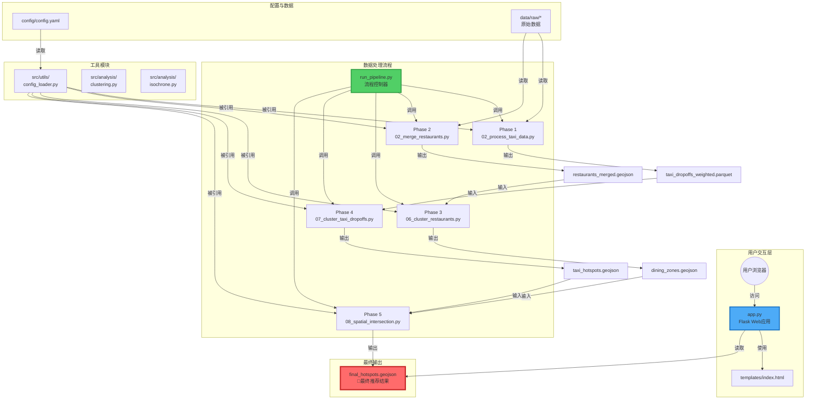
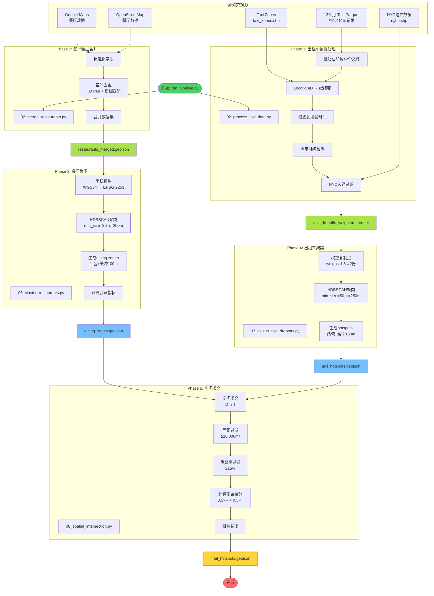
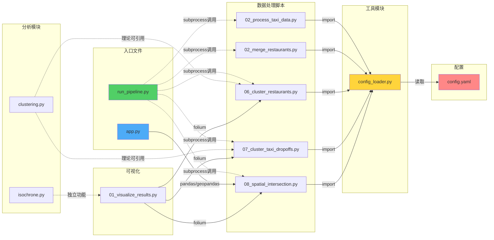
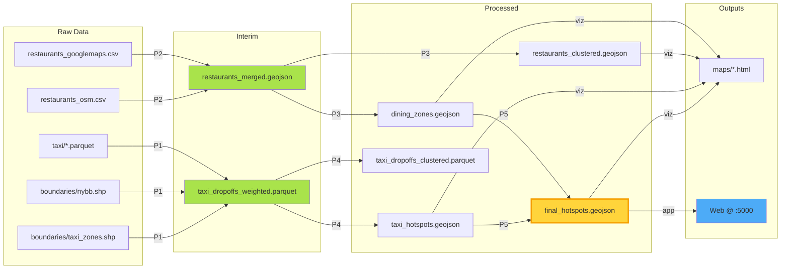
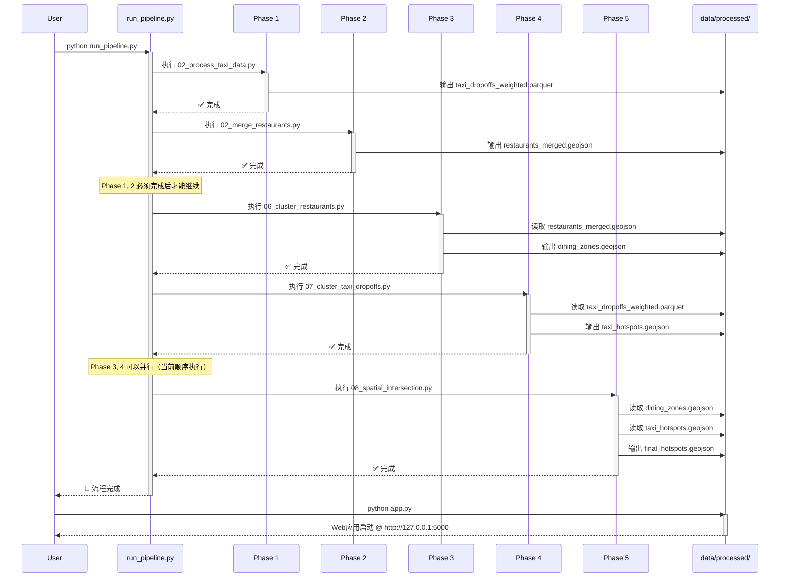
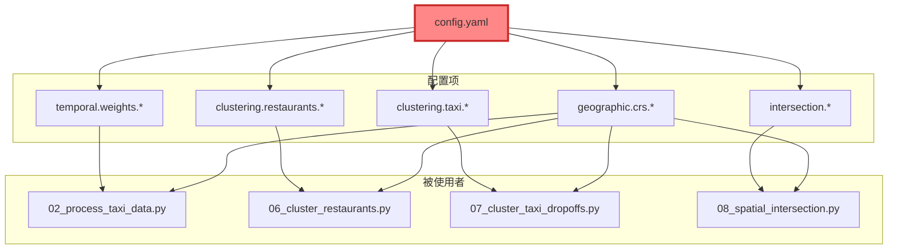
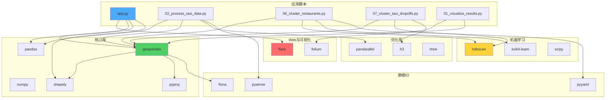
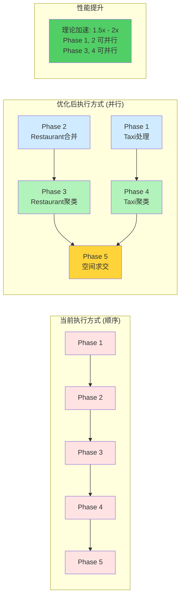

# 项目依赖关系可视化图表

本文档使用 Mermaid 图表展示项目的各种依赖关系。

> **查看提示:** 在支持Mermaid的Markdown查看器中打开（如GitHub、GitLab、VS Code + Mermaid插件）

---

## 1. 整体系统架构图

---

## 2. 数据处理流程详细图

---

## 3. 代码模块依赖关系图

---

## 4. 文件输入输出依赖图

---

## 5. 执行顺序时序图

---

## 6. 配置依赖关系图

---

## 7. 第三方库依赖图

---

## 8. 破坏影响分析图

```mermaid
graph TB
    subgraph "🔴 高风险 - 删除将导致系统失败"
        H1[config.yaml]
        H2[config_loader.py]
        H3[taxi_dropoffs_weighted.parquet]
        H4[restaurants_merged.geojson]
        H5[final_hotspots.geojson]
    end

    subgraph "🟡 中风险 - 删除将导致部分功能失败"
        M1[taxi_zones.shp]
        M2[dining_zones.geojson]
        M3[taxi_hotspots.geojson]
    end

    subgraph "⚪ 低风险 - 删除仅影响可选功能"
        L1[01_visualize_results.py]
        L2[isochrone.py]
        L3[cache/*.json]
    end

    subgraph "影响范围"
        I1[❌ 所有处理脚本]
        I2[❌ Phase 1-5]
        I3[❌ Web应用]
        I4[⚠️ 部分Phase]
        I5[ℹ️ 可视化]
    end

    H1 --> I1
    H2 --> I1
    H3 --> I2
    H4 --> I2
    H5 --> I3

    M1 --> I4
    M2 --> I4
    M3 --> I4

    L1 --> I5
    L2 --> I5
    L3 --> I5

    style H1 fill:#ff6b6b
    style H2 fill:#ff6b6b
    style H3 fill:#ff6b6b
    style H4 fill:#ff6b6b
    style H5 fill:#ff6b6b

    style M1 fill:#ffd43b
    style M2 fill:#ffd43b
    style M3 fill:#ffd43b

    style L1 fill:#d0ebff
    style L2 fill:#d0ebff
    style L3 fill:#d0ebff
```

---

## 9. 并行执行潜力图

---

## 图例说明

### 节点颜色
- 🔴 **红色** - 关键组件，不可删除
- 🟡 **黄色** - 重要输出，影响下游
- 🔵 **蓝色** - Web/交互组件
- 🟢 **绿色** - 控制/处理组件
- ⚪ **白色** - 辅助/可选组件

### 连接类型
- **实线箭头** → 强依赖（必需）
- **虚线箭头** -.-> 弱依赖（可选）
- **粗线箭头** ==> 数据流
- **标注** 说明关系类型

---

**文档生成时间:** 2025-11-17
**适用版本:** v1.0
**查看工具推荐:**
- GitHub/GitLab (原生支持)
- VS Code + Markdown Preview Mermaid Support
- Mermaid Live Editor (https://mermaid.live)
