# Project Dependency Visualization Diagrams

This document uses Mermaid diagrams to visualize various dependency relationships in the project.

> **Viewing Tip:** Open in a Mermaid-compatible Markdown viewer (such as GitHub, GitLab, VS Code + Mermaid plugin)

---

## 1. Overall System Architecture Diagram

```mermaid
graph TB
    subgraph "User Interface Layer"
        APP[app.py<br/>Flask Web App]
        TEMPLATE[templates/index.html]
        USER((User Browser))
    end

    subgraph "Final Output"
        FINAL[final_hotspots.geojson<br/>🎯Final Recommendations]
    end

    subgraph "Data Processing Pipeline"
        PIPELINE[run_pipeline.py<br/>Pipeline Controller]
        P1[Phase 1<br/>02_process_taxi_data.py]
        P2[Phase 2<br/>02_merge_restaurants.py]
        P3[Phase 3<br/>06_cluster_restaurants.py]
        P4[Phase 4<br/>07_cluster_taxi_dropoffs.py]
        P5[Phase 5<br/>08_spatial_intersection.py]
    end

    subgraph "Utility Modules"
        CONFIG[src/utils/<br/>config_loader.py]
        CLUSTER[src/analysis/<br/>clustering.py]
        ISO[src/analysis/<br/>isochrone.py]
    end

    subgraph "Configuration & Data"
        YAML[config/config.yaml]
        RAW[data/raw/*<br/>Raw Data]
    end

    USER -->|accesses| APP
    APP -->|uses| TEMPLATE
    APP -->|reads| FINAL

    PIPELINE -->|calls| P1
    PIPELINE -->|calls| P2
    PIPELINE -->|calls| P3
    PIPELINE -->|calls| P4
    PIPELINE -->|calls| P5

    P1 -->|outputs| TAXI_W[taxi_dropoffs_weighted.parquet]
    P2 -->|outputs| REST_M[restaurants_merged.geojson]
    P3 -->|outputs| DZONE[dining_zones.geojson]
    P4 -->|outputs| THOT[taxi_hotspots.geojson]
    P5 -->|outputs| FINAL

    TAXI_W -->|inputs| P4
    REST_M -->|inputs| P3
    DZONE -->|inputs| P5
    THOT -->|inputs| P5

    CONFIG -->|imported by| P1
    CONFIG -->|imported by| P2
    CONFIG -->|imported by| P3
    CONFIG -->|imported by| P4
    CONFIG -->|imported by| P5

    YAML -->|reads| CONFIG
    RAW -->|reads| P1
    RAW -->|reads| P2

    style FINAL fill:#ff6b6b,stroke:#c92a2a,stroke-width:4px
    style APP fill:#4dabf7,stroke:#1971c2,stroke-width:3px
    style PIPELINE fill:#51cf66,stroke:#2f9e44,stroke-width:3px
```

---

## 2. Detailed Data Processing Flow Diagram

```mermaid
flowchart TD
    START([Start: run_pipeline.py])

    subgraph "Raw Data Sources"
        TAXI_RAW[12-month Taxi Parquet<br/>~140M records]
        REST_GM[Google Maps<br/>Restaurant Data]
        REST_OSM[OpenStreetMap<br/>Restaurant Data]
        BOUND[NYC Boundaries<br/>nybb.shp]
        ZONES[Taxi Zones<br/>taxi_zones.shp]
    end

    subgraph "Phase 1: Taxi Data Processing"
        P1[02_process_taxi_data.py]
        P1_1[Batch load 12 files]
        P1_2[LocationID → Lat/Lon]
        P1_3[Filter to dining hours]
        P1_4[Apply temporal weights]
        P1_5[NYC boundary filter]
    end

    subgraph "Phase 2: Restaurant Merging"
        P2[02_merge_restaurants.py]
        P2_1[Standardize fields]
        P2_2[Spatial deduplication<br/>KDTree + fuzzy matching]
        P2_3[Merge datasets]
    end

    subgraph "Phase 3: Restaurant Clustering"
        P3[06_cluster_restaurants.py]
        P3_1[Coordinate projection<br/>WGS84 → EPSG:2263]
        P3_2[HDBSCAN clustering<br/>min_size=30, ε=200m]
        P3_3[Generate dining zones<br/>Convex hull+buffer 100m]
        P3_4[Calculate metrics]
    end

    subgraph "Phase 4: Taxi Clustering"
        P4[07_cluster_taxi_dropoffs.py]
        P4_1[Weight-based duplication<br/>weight=1.5→2 copies]
        P4_2[HDBSCAN clustering<br/>min_size=50, ε=250m]
        P4_3[Generate hotspots<br/>Convex hull+buffer 150m]
    end

    subgraph "Phase 5: Spatial Intersection"
        P5[08_spatial_intersection.py]
        P5_1[Spatial intersection<br/>D ∩ T]
        P5_2[Area filter<br/>≥10,000m²]
        P5_3[Overlap filter<br/>≥15%]
        P5_4[Calculate scores<br/>0.5×R + 0.5×T]
        P5_5[Rank output]
    end

    START --> P1 & P2

    TAXI_RAW --> P1_1
    ZONES --> P1_2
    P1_1 --> P1_2 --> P1_3 --> P1_4 --> P1_5
    BOUND --> P1_5
    P1_5 --> TAXI_W[taxi_dropoffs_weighted.parquet]

    REST_GM --> P2_1
    REST_OSM --> P2_1
    P2_1 --> P2_2 --> P2_3
    P2_3 --> REST_M[restaurants_merged.geojson]

    REST_M --> P3_1 --> P3_2 --> P3_3 --> P3_4
    P3_4 --> DZONE[dining_zones.geojson]

    TAXI_W --> P4_1 --> P4_2 --> P4_3
    P4_3 --> THOT[taxi_hotspots.geojson]

    DZONE --> P5_1
    THOT --> P5_1
    P5_1 --> P5_2 --> P5_3 --> P5_4 --> P5_5
    P5_5 --> FINAL[final_hotspots.geojson]

    FINAL --> END([Complete])

    style START fill:#51cf66
    style END fill:#ff6b6b
    style FINAL fill:#ffd43b,stroke:#f59f00,stroke-width:3px
    style TAXI_W fill:#a9e34b
    style REST_M fill:#a9e34b
    style DZONE fill:#74c0fc
    style THOT fill:#74c0fc
```

---

## 3. Code Module Dependency Graph

---

## 4. File Input/Output Dependency Diagram

---

## 5. Execution Sequence Timeline

```mermaid
sequenceDiagram
    participant User
    participant Pipeline as run_pipeline.py
    participant P1 as Phase 1
    participant P2 as Phase 2
    participant P3 as Phase 3
    participant P4 as Phase 4
    participant P5 as Phase 5
    participant Data as data/processed/

    User->>Pipeline: python run_pipeline.py
    activate Pipeline

    Pipeline->>P1: Execute 02_process_taxi_data.py
    activate P1
    P1->>Data: Output taxi_dropoffs_weighted.parquet
    P1-->>Pipeline: ✅ Complete
    deactivate P1

    Pipeline->>P2: Execute 02_merge_restaurants.py
    activate P2
    P2->>Data: Output restaurants_merged.geojson
    P2-->>Pipeline: ✅ Complete
    deactivate P2

    Note over Pipeline: Phase 1, 2 must complete before continuing

    Pipeline->>P3: Execute 06_cluster_restaurants.py
    activate P3
    P3->>Data: Read restaurants_merged.geojson
    P3->>Data: Output dining_zones.geojson
    P3-->>Pipeline: ✅ Complete
    deactivate P3

    Pipeline->>P4: Execute 07_cluster_taxi_dropoffs.py
    activate P4
    P4->>Data: Read taxi_dropoffs_weighted.parquet
    P4->>Data: Output taxi_hotspots.geojson
    P4-->>Pipeline: ✅ Complete
    deactivate P4

    Note over Pipeline: Phase 3, 4 can run in parallel (currently sequential)

    Pipeline->>P5: Execute 08_spatial_intersection.py
    activate P5
    P5->>Data: Read dining_zones.geojson
    P5->>Data: Read taxi_hotspots.geojson
    P5->>Data: Output final_hotspots.geojson
    P5-->>Pipeline: ✅ Complete
    deactivate P5

    Pipeline-->>User: 🎉 Pipeline Complete
    deactivate Pipeline

    User->>Data: python app.py
    activate Data
    Data-->>User: Web app started @ http://127.0.0.1:5000
    deactivate Data
```

---

## 6. Configuration Dependency Graph

---

## 7. Third-Party Library Dependency Graph

---

## 8. Failure Impact Analysis Diagram

```mermaid
graph TB
    subgraph "🔴 High Risk - Deletion causes system failure"
        H1[config.yaml]
        H2[config_loader.py]
        H3[taxi_dropoffs_weighted.parquet]
        H4[restaurants_merged.geojson]
        H5[final_hotspots.geojson]
    end

    subgraph "🟡 Medium Risk - Deletion causes partial failure"
        M1[taxi_zones.shp]
        M2[dining_zones.geojson]
        M3[taxi_hotspots.geojson]
    end

    subgraph "⚪ Low Risk - Deletion affects optional features only"
        L1[01_visualize_results.py]
        L2[isochrone.py]
        L3[cache/*.json]
    end

    subgraph "Impact Scope"
        I1[❌ All processing scripts]
        I2[❌ Phase 1-5]
        I3[❌ Web application]
        I4[⚠️ Some phases]
        I5[ℹ️ Visualization]
    end

    H1 --> I1
    H2 --> I1
    H3 --> I2
    H4 --> I2
    H5 --> I3

    M1 --> I4
    M2 --> I4
    M3 --> I4

    L1 --> I5
    L2 --> I5
    L3 --> I5

    style H1 fill:#ff6b6b
    style H2 fill:#ff6b6b
    style H3 fill:#ff6b6b
    style H4 fill:#ff6b6b
    style H5 fill:#ff6b6b

    style M1 fill:#ffd43b
    style M2 fill:#ffd43b
    style M3 fill:#ffd43b

    style L1 fill:#d0ebff
    style L2 fill:#d0ebff
    style L3 fill:#d0ebff
```

---

## 9. Parallel Execution Potential Diagram

---

## Legend

### Node Colors
- 🔴 **Red** - Critical component, cannot be deleted
- 🟡 **Yellow** - Important output, affects downstream
- 🔵 **Blue** - Web/interactive components
- 🟢 **Green** - Control/processing components
- ⚪ **White** - Auxiliary/optional components

### Connection Types
- **Solid arrow** → Strong dependency (required)
- **Dashed arrow** -.-> Weak dependency (optional)
- **Thick arrow** ==> Data flow
- **Label** Describes relationship type

---

**Document Generated:** 2025-11-17
**Applicable Version:** v1.0
**Recommended Viewing Tools:**
- GitHub/GitLab (native support)
- VS Code + Markdown Preview Mermaid Support
- Mermaid Live Editor (https://mermaid.live)
